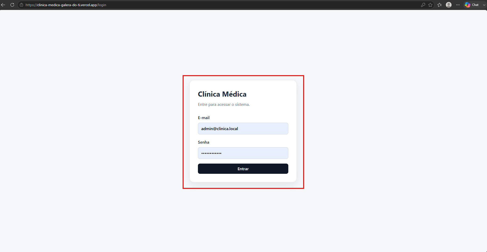
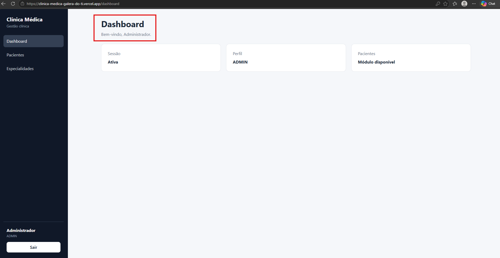

# CT-AUT-01 — Realizar login com credenciais válidas

- **Feature:** [Autenticação](../README.md)
- **Tags:** Funcional · Positivo · Autenticação
- **Status:** ✅ Passou
- **Pré-condições:** O usuário deve estar corretamente cadastrado e ativo no sistema.

**Descrição:** Validar se o sistema permite o acesso de usuários devidamente cadastrados e ativos com credenciais corretas.

## Cenário

```gherkin
# language: pt
Funcionalidade: Autenticação

  @CT-AUT-01 @funcional @positivo @autenticacao
  Cenário: Realizar login com credenciais válidas
    Dado que o usuário possui um cadastro ativo e credenciais válidas no sistema
    Quando o usuário informa seu e-mail e sua senha corretamente na tela de login
    E confirma o seu acesso clicando no botão "Entrar"
    Então o sistema deve autenticar o usuário com sucesso
    E direcioná-lo para a página inicial/dashboard correspondente ao seu perfil
```

## Resultado

- **Esperado:** O usuário é autenticado com sucesso e redirecionado para o dashboard da aplicação.
- **Encontrado:** Conforme esperado. ✅

## Execução

| Data | Ambiente | Navegador | Resultado | Executor |
|---|---|---|---|---|
| 25/08/2026 |Windows 11 Pro| Chrome | ✅ | Marcelo Henrique|

## Evidências

**01 · Inicial**



**02 · Sucesso**


