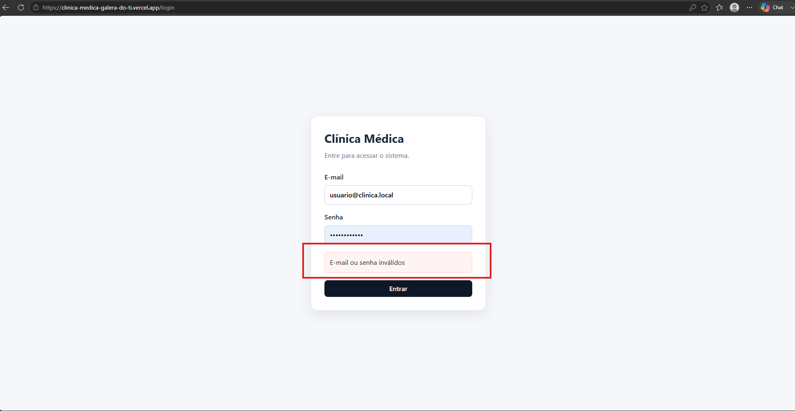

# CT-AUT-02 — Bloquear login com senha incorreta

- **Feature:** [Autenticação](../README.md)
- **Tags:** Funcional · Negativo · Segurança
- **Status:** ✅ Passou

- **Pré-condições:** O usuário deve estar corretamente cadastrado e ativo no sistema.
 
**Descrição:** Garantir que o sistema proteja o acesso contra tentativas de login com senhas inválidas.

## Cenário

```gherkin
# language: pt
Funcionalidade: Autenticação

  @CT-AUT-02 @funcional @negativo @seguranca
  Cenário: Bloquear login com senha incorreta
    Dado que o usuário está na tela de login do sistema
    Quando ele preenche um e-mail cadastrado, mas informa uma senha incorreta
    E confirma a tentativa de acesso
    Então o sistema deve bloquear a autenticação
    E exibir uma mensagem amigável informando que as credenciais são inválidas, mantendo o usuário na tela de login
```

##  Execução

| Data | Ambiente | Navegador | Resultado | Executor |
|---|---|---|---|---|
| 25/08/2026 |Windows 11 Pro| Chrome | ✅ | Marcelo Henrique|


## Resultado

- **Esperado:** O acesso é negado, a mensagem de erro amigável é exibida e o usuário permanece na tela de login.
- **Encontrado:** Conforme esperado. ✅

## Evidências

**01 · Sucesso**


