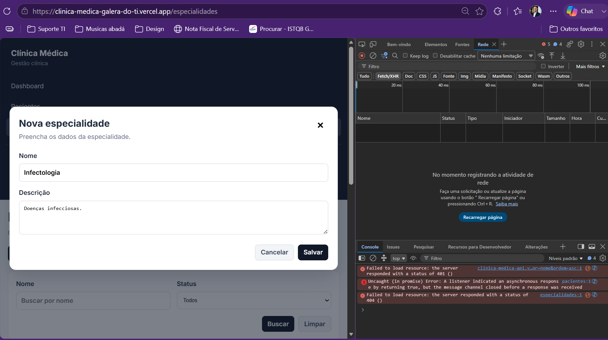
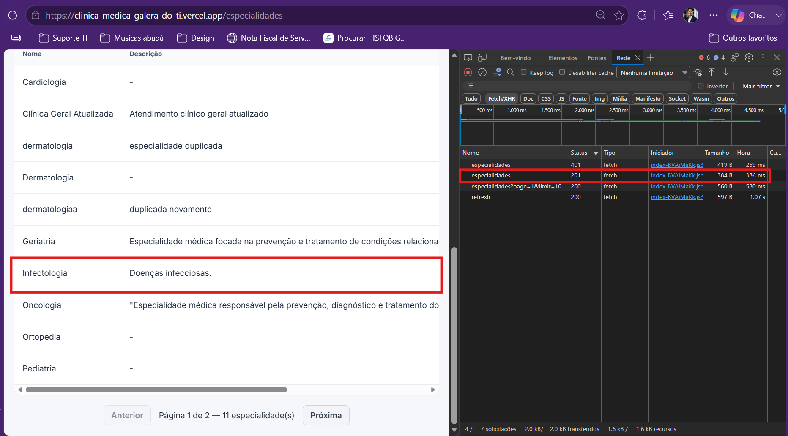

# CT-ESP-01 — Cadastrar especialidade com sucesso

- **Feature:** [Especialidades](../README.md)
- **Tags:** Funcional · Positivo · Cadastro
- **Status:** ✅ Passou
- **Pré-condições:** O usuário deve estar autenticado com um perfil de Administrador.

**Descrição:** Validar o cadastro de uma nova especialidade informando os dados obrigatórios corretamente.

## Cenário

```gherkin
# language: pt
Funcionalidade: Especialidades

  @CT-ESP-01 @funcional @positivo @cadastro
  Cenário: Cadastrar especialidade com sucesso
    Dado que o usuário possui o perfil de Administrador e está na tela de gestão de especialidades
    Quando ele preenche o campo obrigatório Nome com um valor único (ex: "Cardiologia")
    E preenche a Descrição opcional
    E clica em salvar
    Então o sistema deve registrar a especialidade com o status ativo por padrão
    E retornar uma mensagem de sucesso.
```

## Execução

| Data | Ambiente | Navegador | Resultado | Executor |
|---|---|---|---|---|
| 11-09-2026 | Windows 11 Pro | Chrome | ✅ | Marcelo Henrique |


## Resultado

- **Esperado:** A especialidade é criada com sucesso, listada como ativa e fica disponível para vínculo.
- **Encontrado:** Conforme o esperado. ✅ Código de status retornado (HTTP 201)

## Evidências

**01 · Inicial**



**02 · Sucesso**


