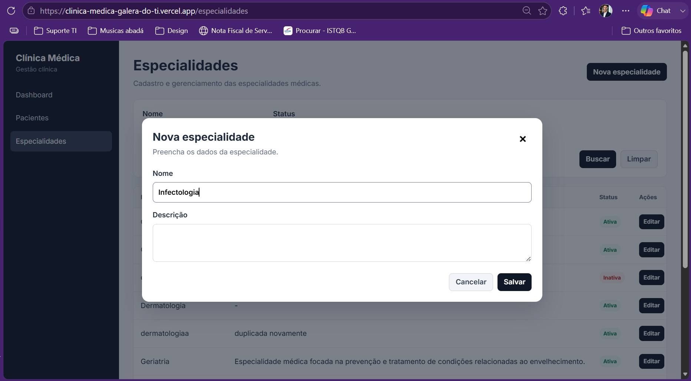
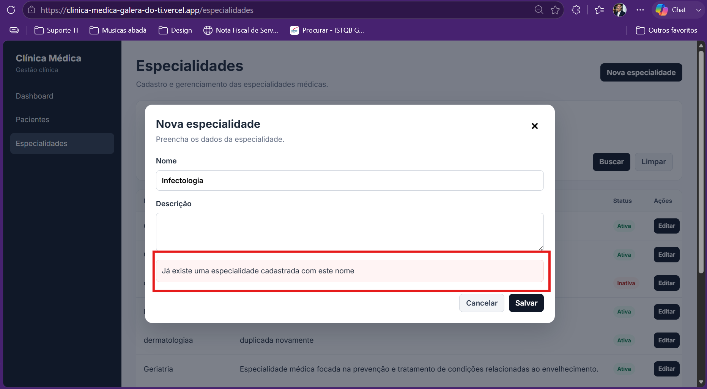

# CT-ESP-02 — Bloquear cadastro de especialidade com nome duplicado

- **Feature:** [Especialidades](../README.md)
- **Tags:** Regra de negócio · Integridade
- **Status:** ✅ Passou
- **Pré-condições:** Deve existir uma especialidade previamente cadastrada no sistema.

**Descrição:** Garantir que o sistema bloqueie a criação de especialidades com nomes já existentes na base de dados.

## Cenário

```gherkin
# language: pt
Funcionalidade: Especialidades

  @CT-ESP-02 @regra-de-negocio @integridade
  Cenário: Bloquear cadastro de especialidade com nome duplicado
    Dado que já existe uma especialidade cadastrada com o nome "Pediatria"
    Quando o Administrador tenta cadastrar uma nova especialidade informando exatamente o mesmo nome "Pediatria"
    E tenta salvar o registro
    Então o sistema deve rejeitar a operação indicando conflito (HTTP 409)
    E exibir uma mensagem de erro estruturada alertando sobre a duplicidade
```

## Execução

| Data | Ambiente | Navegador | Resultado | Executor |
|---|---|---|---|---|
| 11-09-2026 | Windows 11 Pro | Chrome | ✅ | Marcelo Henrique |


## Resultado

- **Esperado:** A operação é cancelada e a duplicidade é evitada.
- **Encontrado:** Conforme o esperado. ✅

## Evidências

**01 · Inicial**



**02 · Sucesso**


