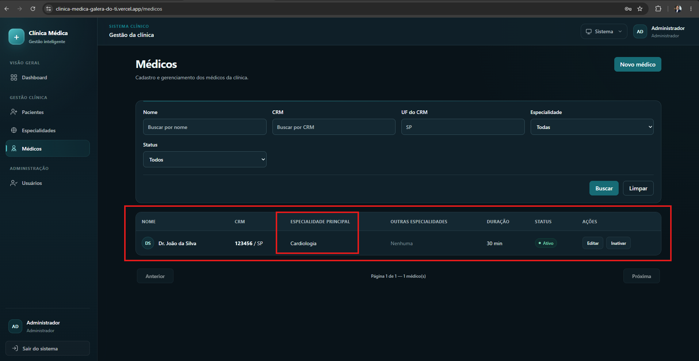
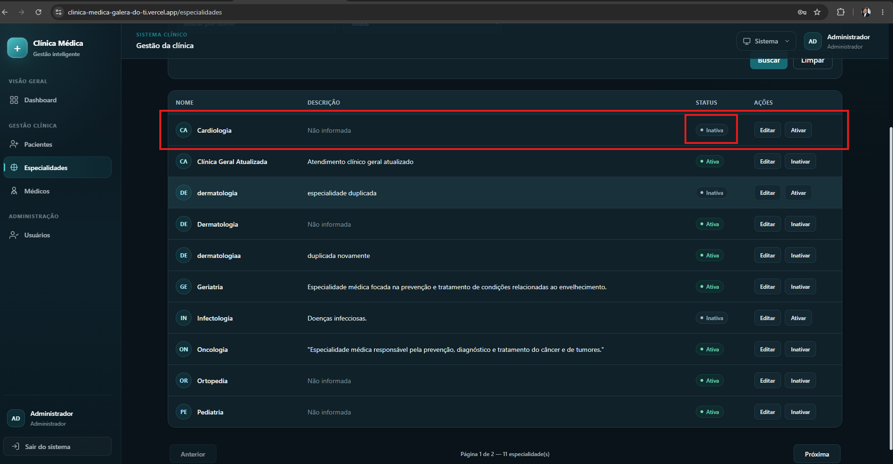

# CT-ESP-04 — Impedir remoção de especialidade com médicos vinculados

- **Feature:** [Especialidades](../README.md)
- **Tags:** Integridade referencial
- **Status:** 💡 Melhoria
- **Pré-condições:** A especialidade deve estar vinculada a pelo menos um médico ativo.

**Descrição:** Validar a regra de negócio que protege a integridade do banco de dados, impedindo a exclusão de especialidades em uso.

## Cenário

```gherkin
# language: pt
Funcionalidade: Especialidades

  @CT-ESP-04 @integridade-referencial
  Cenário: Impedir remoção de especialidade com médicos vinculados
    Dado que uma especialidade possui médicos vinculados a ela no sistema
    Quando o Administrador tenta realizar a exclusão ou remoção dessa especialidade
    Então o sistema deve bloquear a ação para preservar a integridade referencial
    E exibir um aviso informando que a especialidade não pode ser removida pois existem médicos vinculados
```

## Execução

| Data | Ambiente | Navegador | Resultado | Executor |
|---|---|---|---|---|
| 23/09/2026 | Windows 11 Pro | Chrome | 💡 | Marcelo Henrique |


## Resultado

- **Esperado:** A exclusão falha e os vínculos antigos continuam preservados.
- **Encontrado:** O sistema permitiu inativação da especialidade, mesmo tendo pelo menos um médico vinculado à especialidade testada.

## Classificação

**💡 Melhoria** — não é defeito. A sugestão está registrada em [MEL-001](../../../melhorias/MEL-001-avisar-ao-inativar-especialidade-com-medicos-vinculados.md).

**Justificativa:** os cenários do módulo não deixam explícito se a inativação conta como "remoção". Como a interface só oferece Inativar/Ativar (não há ação de excluir) e o módulo prevê exclusão lógica, a inativação com médicos vinculados foi tratada como comportamento aceitável. O ponto de atenção é a falta de aviso ao usuário.

## Evidências

**01 · Condição**



**02 · Melhoria**


