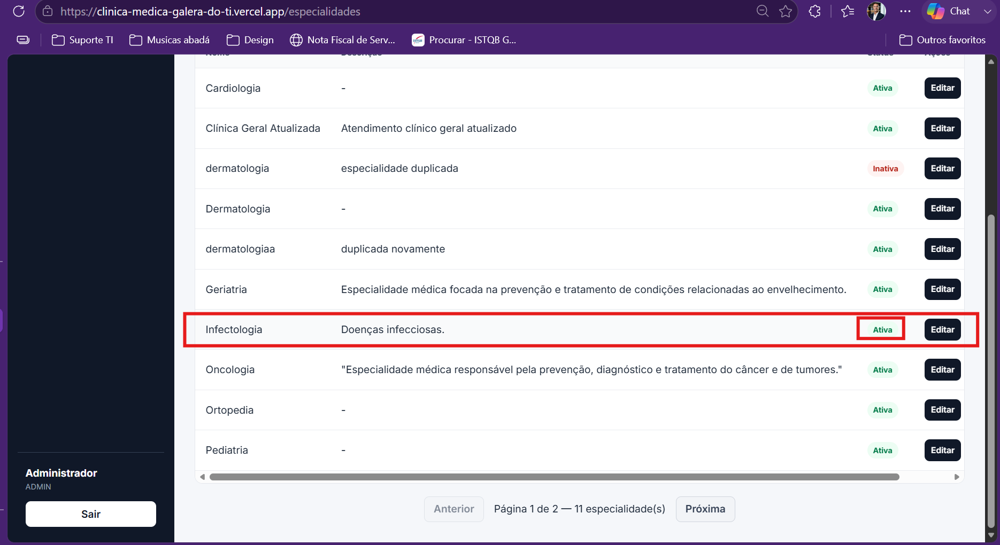
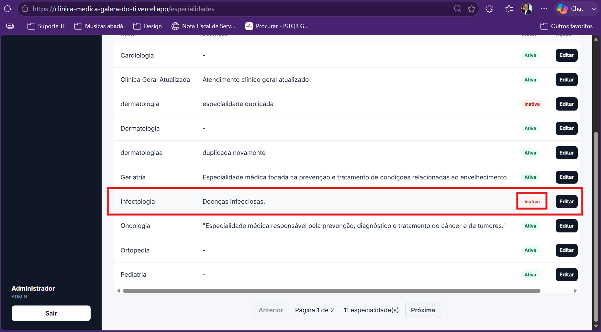

# CT-ESP-05 — Desativar especialidade sem vínculos ativos

- **Feature:** [Especialidades](../README.md)
- **Tags:** Funcional · Inativação Lógica
- **Status:**✅ Passou
- **Pré-condições:** A especialidade deve estar ativa e sem médicos vinculados no sistema.

**Descrição:** Validar a inativação de uma especialidade que não possui médicos vinculados, sem realizar a exclusão física do registro no banco de dados.

## Cenário

```gherkin
# language: pt
Funcionalidade: Autenticação

  @CT-ESP-05 @funcional @inativacao-logica
  Cenário: Desativar especialidade sem vínculos ativos
    Dado que a especialidade está ativa e não possui médicos vinculados
    Quando o administrador seleciona a opção de desativar a especialidade
    E confirma a ação de inativação
    Então o sistema deve alterar o status da especialidade para inativo
    E preservar o registro na base de dados para consultas futuras, sem excluí-lo fisicamente
```

## Execução

| Data | Ambiente | Navegador | Resultado | Executor |
|---|---|---|---|---|
| 11/09/2026 | Windows 11 Pro | Chrome | ✅ | Marcelo Henrique |


## Evidências

**01 · Condição**



**02 · Sucesso**


