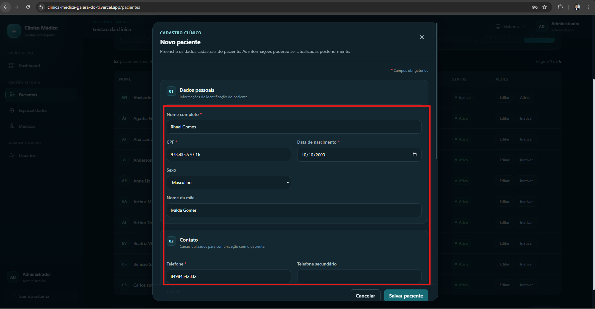
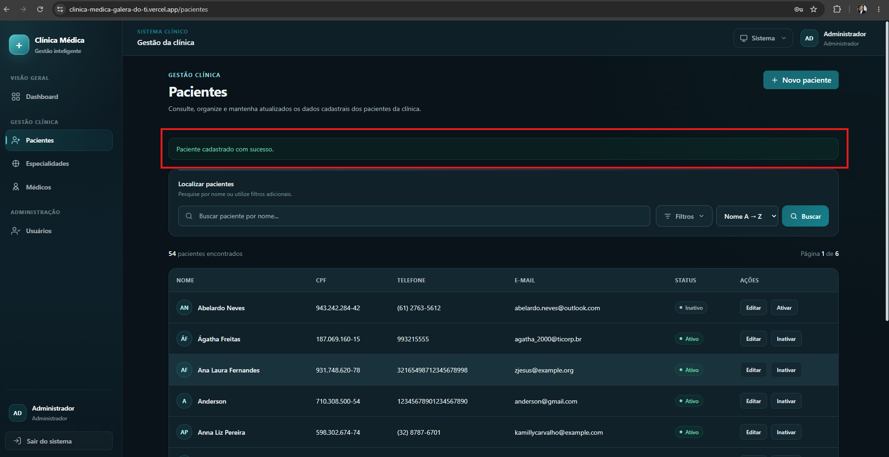

# CT-PAC-01 — Cadastrar paciente com sucesso

- **Feature:** [Pacientes](../README.md)
- **Tags:** Funcional · Positivo · Ciclo de vida de Pacientes
- **Status:** ✅ Passou

**Descrição:** Validar o registro bem-sucedido de um novo paciente preenchendo todos os dados obrigatórios e válidos.

## Cenário

```gherkin
# language: pt
Funcionalidade: Pacientes

  @CT-PAC-01 @funcional @positivo @ciclo-de-vida-de-pacientes
  Cenário: Cadastrar paciente com sucesso
    Dado que um recepcionista ou administrador está na tela de cadastro de pacientes
    Quando ele preenche todos os dados obrigatórios válidos (Nome completo, CPF válido e único, Data de nascimento e pelo menos um meio de contato)
    E clica em salvar o registro
    Então o sistema deve cadastrar o paciente com o status ativo
    E exibir uma mensagem de sucesso, listando o novo paciente na base de dados da clínica
   ```

## Execução

| Data | Ambiente | Navegador | Resultado | Executor |
|---|---|---|---|---|
| 25-08-2026 | Windows 11 Pro | Chrome |✅ | Marcelo Henrique |
## Resultado

- **Esperado:** O paciente é salvo com status ativo, exibe mensagem de sucesso e aparece na listagem.
- **Encontrado:** Conforme esperado ✅ 

## Evidências

**01 · Condição**



**02 · Sucesso**


