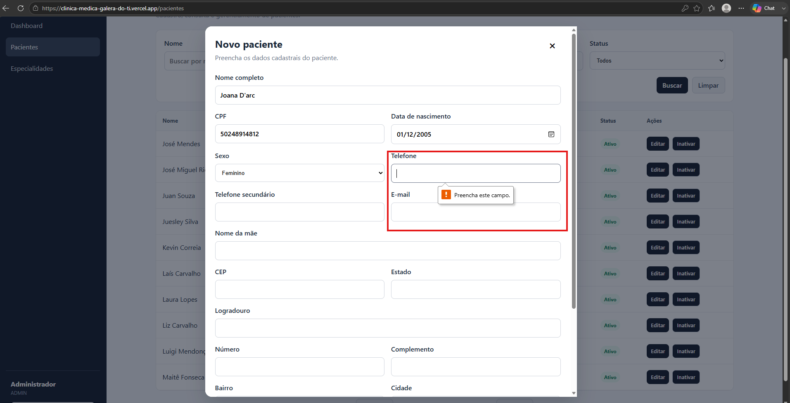

# CT-PAC-02 — Validar obrigatoriedade de meio de contato do paciente

- **Feature:** [Pacientes](../README.md)
- **Tags:** Regra de negócio · Validação de campos
- **Status:** ✅ Passou
- **Pré-condições:** O usuário deve estar na tela de cadastro de novo paciente.

**Descrição:** Garantir que o sistema exija o número do telefone como meio de comunicação para contato com o paciente.

## Cenário

```gherkin
# language: pt
Funcionalidade: Pacientes

  @CT-PAC-02 @regra-de-negocio @validacao-de-campos
  Cenário: Validar obrigatoriedade de meio de contato do paciente
    Dado que o usuário está preenchendo o formulário de cadastro de um novo paciente
    Quando ele informa nome, CPF e data de nascimento, mas deixa o campo de Telefone totalmente em branco
    E tenta submeter o formulário
    Então o sistema deve bloquear o cadastro do paciente
    E exibir uma mensagem indicando a obrigatoriedade de preencher o campo Telefone
```

## Execução

| Data | Ambiente | Navegador | Resultado | Executor |
|---|---|---|---|---|
| 25-08-2026 | Windows 11 Pro | Chrome | ✅ | Marcelo Henrique |

## Resultado

- **Esperado:** O sistema bloqueia o envio e aponta o erro de validação do campo de contato obrigatório.
- **Encontrado:** Conforme esperado. ✅

## Evidências

**01 · Sucesso**


