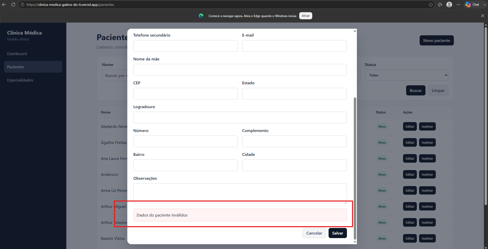
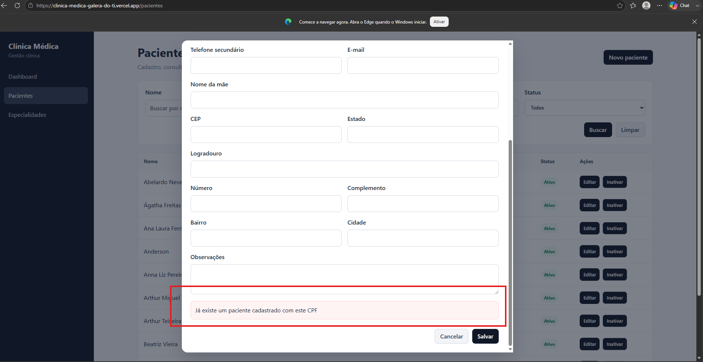

# CT-PAC-03 — Impedir cadastro com CPF inválido ou duplicado

- **Feature:** [Pacientes](../README.md)
- **Tags:** Validação · Integridade de dados
- **Status:** ✅ Passou
- **Pré-condições:** Deve existir um paciente cadastrado com um CPF específico na base.

**Descrição:** Validar as barreiras de integridade para o campo CPF (formato correto e unicidade na base).

## Cenário

```gherkin
# language: pt
Funcionalidade: Pacientes

  @CT-PAC-03 @validacao @integridade-de-dados
  Cenário: Impedir cadastro com CPF inválido ou duplicado
    Dado que já existe um paciente cadastrado com um CPF específico no sistema
    Quando o operador tenta cadastrar um novo paciente informando um número de CPF com formato inválido ou repete um CPF já existente
    E tenta salvar as informações
    Então o sistema deve rejeitar a operação em ambos os casos
    E apresentar uma mensagem de erro clara alertando sobre o formato incorreto ou a duplicidade do documento
```

## Execução

| Data | Ambiente | Navegador | Resultado | Executor |
|---|---|---|---|---|
| 25-08-2026 | Windows 11 Pro | Chrome | ✅ | Marcelo Henrique |

## Resultado

- **Esperado:** A operação é rejeitada e mensagens específicas de formato inválido ou CPF duplicado são exibidas.
- **Encontrado:** Conforme esperado. ✅

## Evidências

**01 · CPF inválido — sucesso**



**02 · CPF duplicado — sucesso**


