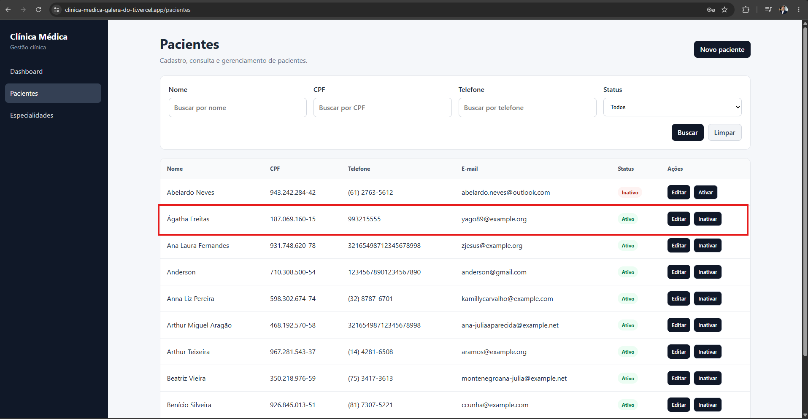
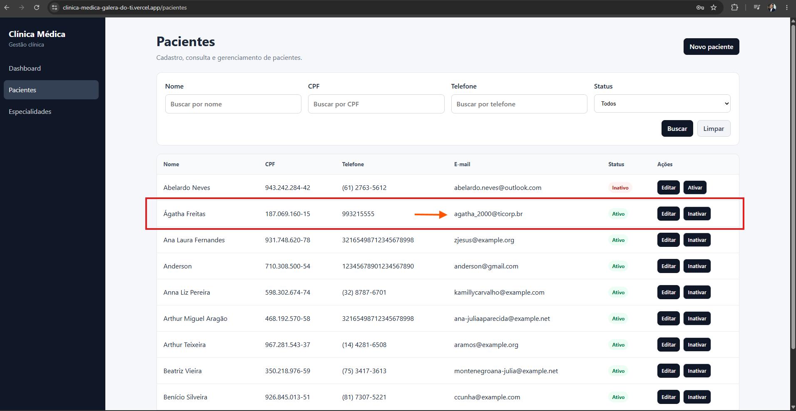

# CT-PAC-04 — Editar dados cadastrais do paciente

- **Feature:** [Pacientes](../README.md)
- **Tags:** Funcional · Atualização
- **Status:** ✅ Passou
- **Pré-condições:** O paciente deve estar previamente cadastrado e ativo no sistema.

**Descrição:** Validar a capacidade de atualizar informações cadastrais de um paciente já existente.

## Cenário

```gherkin
# language: pt
Funcionalidade: Pacientes

  @CT-PAC-04 @funcional @atualizacao
  Cenário: Editar dados cadastrais do paciente
    Dado que o paciente já possui um cadastro ativo no sistema
    Quando o recepcionista/administrador edita as informações permitidas (como telefone, endereço ou observações)
    E confirma as alterações
    Então os dados do paciente devem ser atualizados com sucesso na tela
```

## Execução

| Data | Ambiente | Navegador | Resultado | Executor |
|---|---|---|---|---|
| 09-09-2026 | Windows 11 Pro | Chrome | ✅ | Marcelo Henrique |


## Resultado

- **Esperado:** As alterações são salvas na interface.
- **Encontrado:** Conforme o esperado. ✅

## Evidências

**01 · Inicial**



**02 · Sucesso**


