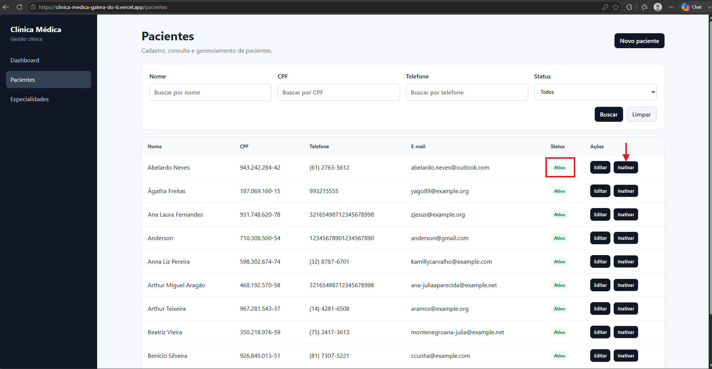
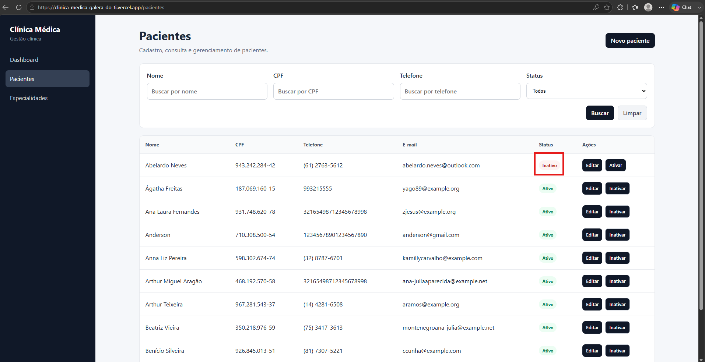

# CT-PAC-05 — Desativar cadastro de paciente

- **Feature:** [Pacientes](../README.md)
-  **Tags:** Funcional · Positivo · Exclusão Lógica
- **Status:** ✅ Passou

**Descrição:** Validar a inativação de um paciente sem realizar a exclusão física do registro no banco de dados.

## Cenário

```gherkin
# language: pt
Funcionalidade: Pacientes

  @CT-PAC-01 @funcional @positivo @exclusao-logica
  Cenário: Validar a inativação de um paciente sem realizar a exclusão física do registro no banco de dados.
    Dado que o operador localiza um paciente ativo na listagem do sistema
    Quando ele seleciona a opção de desativar o cadastro do paciente
    E confirma a ação de inativação
    Então o sistema deve alterar o status do paciente para inativo
    E preservar o histórico do paciente na base de dados para consultas futuras, sem excluí-lo fisicamente
```

## Execução

| Data | Ambiente | Navegador | Resultado | Executor |
|---|---|---|---|---|
| 01-09-2026 | Windows 11 Pro | Chrome | ✅ | Marcelo Henrique |


## Resultado

- **Esperado:** O paciente passa para o status inativo e seus dados históricos são preservados no sistema.
- **Encontrado:** Conforme o esperado. ✅ 
## Evidências

**01 · Condição**



**02 · Sucesso**


