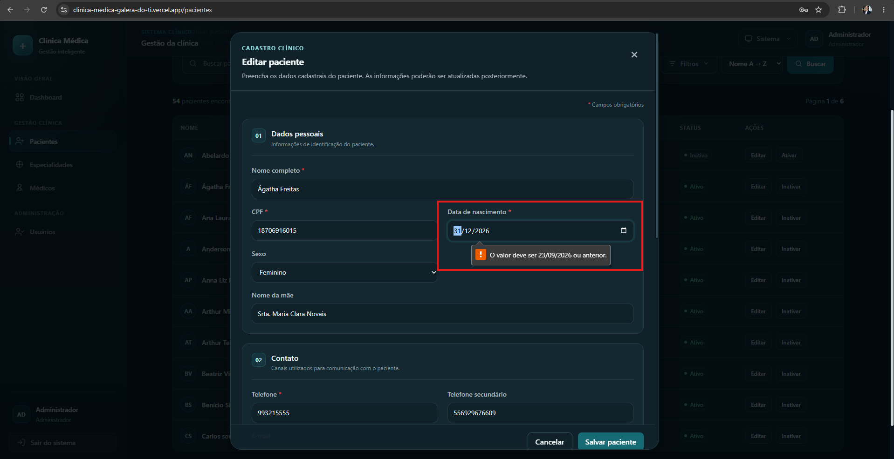

# CT-PAC-EDGE-01 — Tentativa de cadastro com data de nascimento irreal

- **Feature:** [Pacientes](../README.md)
- **Tags:** Validação · Limites de domínio e datas
- **Status:** ✅ Passou
- **Pré-condições:** O usuário deve estar autenticado e na tela de cadastro de um novo paciente.

**Descrição:** Validar a regra de negócio que impede o cadastro de pacientes com datas de nascimento inválidas, como datas no futuro ou excessivamente distantes no passado.

## Cenário

```gherkin
# language: pt
Funcionalidade: Pacientes

  @CT-PAC-EDGE-01 @validacao @limites-de-dominio-e-datas
  Cenário: Tentativa de cadastro com data de nascimento irreal
    Dado que o usuário está na tela de cadastro de um novo paciente
    Quando ele preenche o campo "Data de Nascimento" com uma data no futuro (ex: amanhã) ou uma data excessivamente distante (ex: 01/01/1850)
    E tenta salvar o registro
    Então o sistema deve bloquear a ação
    E exibir uma mensagem de erro informando que a data de nascimento é inválida ou irreal
```

## Execução

| Data | Ambiente | Navegador | Resultado | Executor |
|---|---|---|---|---|
| 11-09-2026 | Windows 11 Pro | Chrome | ✅ | Marcelo Henrique |


## Resultado

- **Esperado:** O cadastro é bloqueado e uma mensagem de erro clara é exibida ao usuário.
- **Encontrado:** Conforme o esperado. ✅

## Evidências

**01 · Sucesso**


